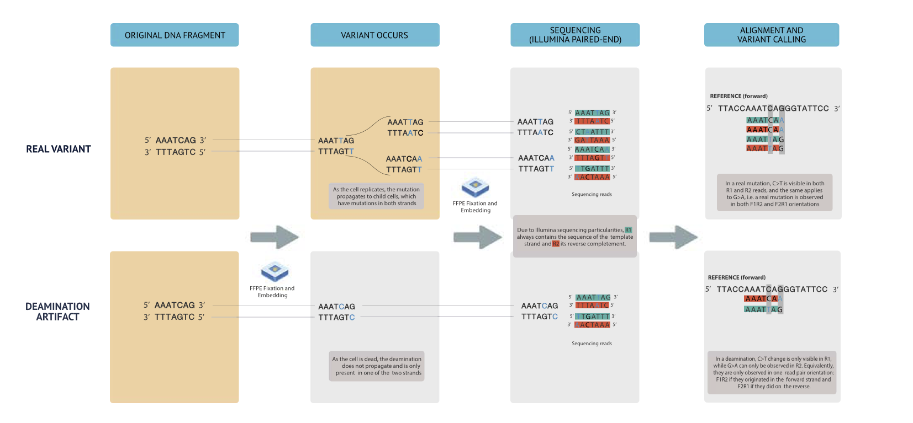

```{r, include = FALSE}
knitr::opts_chunk$set(
  collapse = TRUE,
  comment = "#>"
)
```

<!-- \newpage 
\tableofcontents
\newpage
-->

\newpage

## What is Ideafix?

Ideafix is a package for variant refinement designed specifically for FFPE DNA sequencing data. 

DNA obtained from FFPE samples suffers from significant levels of fragmentation, denaturation, cross-linking and chemical modifications, all of which can contribute to sequence artefacts. One of the most prevalent artefacts is deamination of cytosine residues to uracil, which, as a consequence of successive PCR amplification rounds, results in the C$>$T (or G$>$A anti-sense strand) variant. So far, there is no gold-standard technique to distinguish real variants from FFPE artifacts.

Ideafix is a decision tree-based variant refinement tool that identifies cytosine deaminations in lists of variants (vcf files) found in DNA sequencing data from FFPE specimens. It takes as an input a vcf file resulting from variant calling on an bam file from FFPE data, looks for C:G $>$ T:A variants with a VAF $<$ 30\% and identifies which of them are formalin-induced deaminations or artefacts. Ideafix outputs a table indicating the class label and the score for each variant, and allows the user to finally append the annotations to the original vcf file or simply output the table to a separate text file.

Ideafix is a tool based on fully supervised learning and in fact uses two different models to do the variant classification: XGBoost or Random Forest (RF). Both models show outstanding performance (AUC $>$ 0.95) so the user can decide which one to use indistinctively. 

As a fully supervised model, Ideafix is trained over a series of 23 variant descriptors related to allele-frequency, sequencing quality, fragment length and read-orientation bias, among others. One of the main contributing feature to the model is FDeamC, which is a numeric descriptor that reflects read-pair orientation bias. The following figure summarizes what read-pair orientation bias is, why it arises and how it can be relevant for identifying cytosine deaminations:

{width=100%}

Ideafix is described in detail in an article that is currently under review and we will provide the link to it as long as it gets published.

## Installation

Ideafix can be installed from Github as follows:

```{r eval=FALSE}
if (!require("devtools")) install.packages("devtools")
devtools::install_github("mmaitenat/ideafix")
```

Note that installation may take a while as the size of the package is in the order of hundreds of Mbs. 

## Requirements

ideafix needs the following programs to run:

* bcftools

* samtools (>1.8)

It also depends on the following packages:

* h2o 3.22.1.1

ideafix also needs the following files:

* VCF file obtained from an FFPE specimen. Variant calling needs to be run with Mutect2, with strand bias annotation enabled. It can be either a tumor-only or a normal-tumor paired variant calling. For example:

```{bash eval=FALSE}
gatk4="java -jar /opt/gatk-4.0.8.1/gatk-package-4.0.8.1-local.jar"
REF=~/Data/hg19/ucsc.hg19.fasta

$gatk4 Mutect2 \
     -R $REF \
     -I sample.bam \
     -tumor sample_id \
     -O sample.vcf \
     --annotation StrandBiasBySample

```


* Fasta file of the genome data was aligned to.

## Workflow


```{r setup}
library(ideafix)
```

## Session Info

```{r}
sessionInfo()
```
